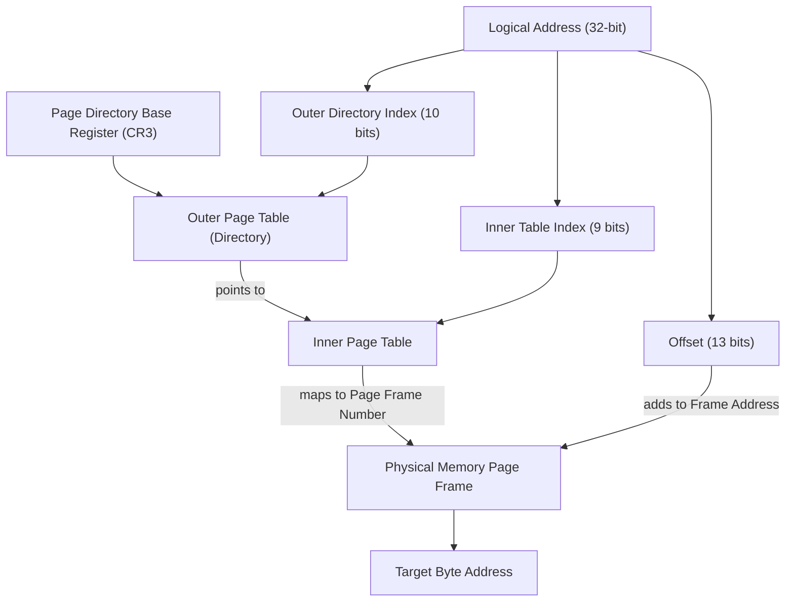
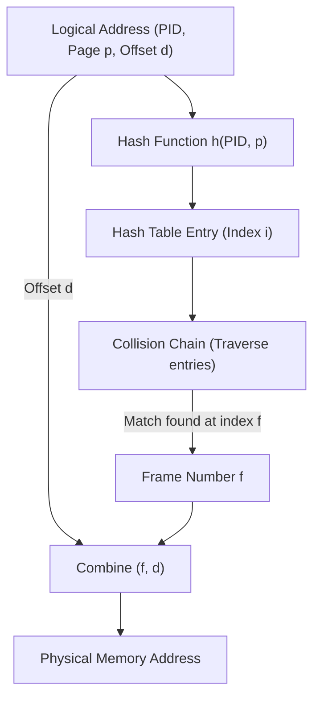
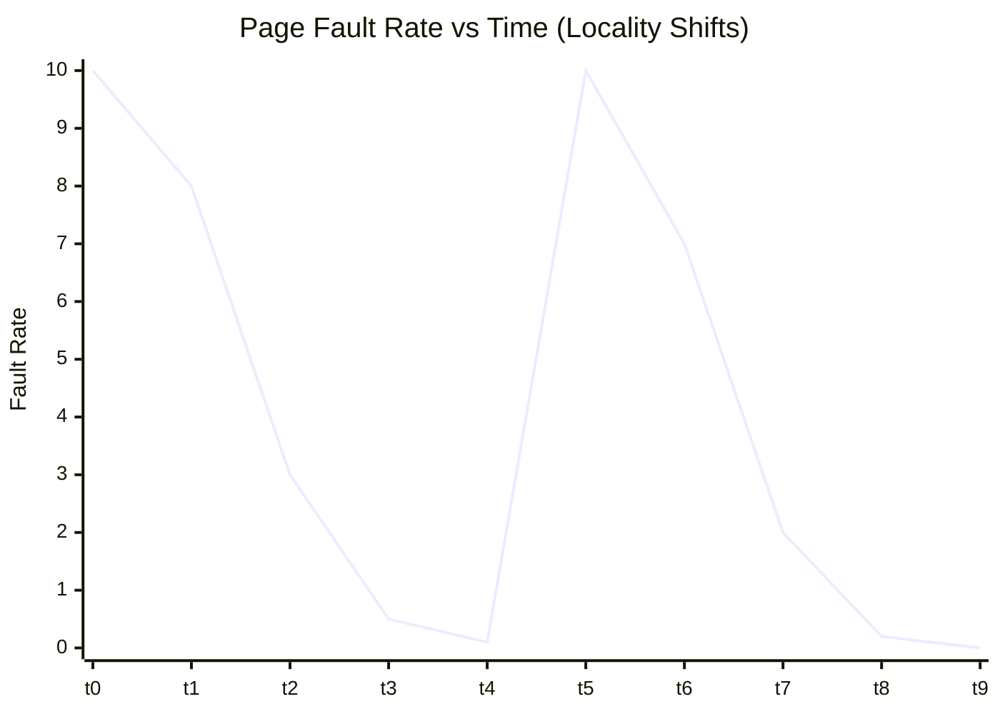
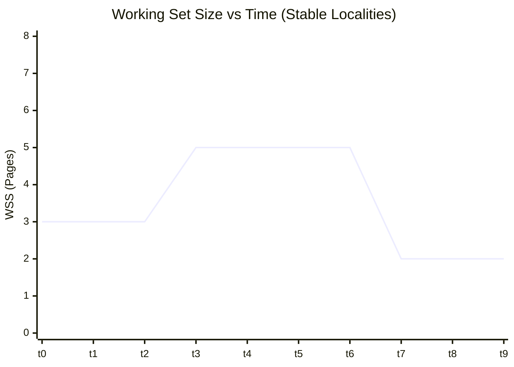

# 🧠 Bar-Ilan University Operating Systems (89-231) — Exam Solver Guide
This comprehensive guide provides step-by-step algorithmic recipes, formulas, mathematical derivations, and code tracing strategies to solve every type of question on the BIU Operating Systems final exam.

---

## 📊 Table of Contents
1. [CPU & Disk Scheduling Algorithms](#1-cpu--disk-scheduling-algorithms)
2. [Process Synchronization & Coordination](#2-process-synchronization--coordination)
3. [Deadlock Proofs & Banker's Algorithm](#3-deadlock-proofs--bankers-algorithm)
4. [Memory Management, TLB & Effective Access Time (EAT)](#4-memory-management-tlb--effective-access-time-eat)
5. [Page Replacement & Virtual Memory Graphs](#5-page-replacement--virtual-memory-graphs)
6. [File Systems, Inodes & Links](#6-file-systems-inodes--links)
7. [POSIX Systems Programming & IPC (fork, signals, pipes)](#7-posix-systems-programming--ipc)

---

## 1. CPU & Disk Scheduling Algorithms

### 🔑 CPU Scheduling Metrics
* **Turnaround Time (TAT)**: $t_{\text{completion}} - t_{\text{arrival}}$
* **Waiting Time (WT)**: $\text{Turnaround Time} - \text{Burst Time}$
* **Average Waiting Time (AWT)**: $\frac{\sum \text{WT}}{n}$
* **Response Time (RT)**: $t_{\text{first\_execution}} - t_{\text{arrival}}$

### 🚶‍♂️ CPU Scheduling Recipes

#### 1. First-Come, First-Served (FCFS)
* **Rule**: Process jobs in the order of their physical arrival times. Non-preemptive.
* **Recipe**:
  1. Sort processes by arrival time $t_{\text{arr}}$.
  2. The first process runs from $t_{\text{start}} = t_{\text{arr}}$ to $t_{\text{end}} = t_{\text{arr}} + \text{Burst}$.
  3. Subsequent processes run sequentially: $t_{\text{start}}^{(i)} = \max\left(t_{\text{end}}^{(i-1)}, t_{\text{arr}}^{(i)}\right)$.

#### 2. Shortest Job First (SJF) — Non-Preemptive
* **Rule**: Run the available process with the shortest CPU burst next. Once started, it runs to completion.
* **Recipe**:
  1. At $t=0$, evaluate all arrived processes. Select the one with the smallest Burst Time.
  2. Run it to completion. Update current time $t = t_{\text{end}}$.
  3. Evaluate all processes that arrived at or before $t$. Pick the one with the smallest Burst Time.
  4. Repeat until all processes are scheduled.

#### 3. Shortest Remaining Time First (SRTF) — Preemptive SJF
* **Rule**: At any point a new process arrives or a process completes, compare remaining CPU burst times. Run the shortest remaining burst.
* **Recipe**:
  1. Track the timeline, pausing at every **arrival event** or **completion event**.
  2. At each event, list all active processes and their remaining burst times.
  3. Assign the CPU to the process with the minimum remaining time. Run until the next event.
  4. If a process is preempted, save its remaining burst time.

#### 4. Round Robin (RR) with Time Quantum $q$
* **Rule**: Give each process a fixed slice of time $q$. If not finished, preempt it and place it at the back of the queue.
* **Recipe**:
  1. Maintain an explicit **Ready Queue** (FIFO).
  2. At $t=0$, push all arriving processes into the queue in the order specified.
  3. Pop the front process, run it for $\min(q, \text{remaining\_burst})$.
  4. During this execution window, if any *new* processes arrive, push them onto the queue *first*.
  5. If the current process did not finish, push it back to the tail of the queue *after* the newly arrived ones.
  6. Repeat until the queue is empty.

#### 5. Handling Context Switch Overhead ($C$)
* **Scenario**: Every context switch between two processes takes $C$ seconds.
* **Recipe**:
  * In non-preemptive SJF/FCFS: Add $C$ before the execution of the first process (only if specified) and between each successive process.
  * In RR: Add $C$ every time a process is preempted or completes, shifting the next process start time forward by $C$.

#### 6. Conceptual Trade-off: Mean vs. Variance of Waiting Time
* **SJF/SRTF**: Minimizes the mathematical mean waiting time. However, it maximizes waiting time **variance** because long processes can experience starvation (indefinite postponement), making response times unpredictable.
* **FCFS/RR**: Higher mean waiting time, but lower variance of waiting times. Round Robin guarantees a bounded response time for all processes.

---

### 🔑 Disk Scheduling Algorithms
* **Goal**: Minimize head seek distance (cylinders traversed).
* **Parameters**: Cylinder range (e.g., $0$ to $299$), current head position (e.g., $120$), current direction (up/down), pending request queue.

#### 🚶‍♂️ Disk Scheduling Recipes

#### 1. FCFS (First-Come, First-Served)
* **Rule**: Service requests in the exact order they arrive in the queue.
* **Recipe**: If queue is $[45, 250, 15]$, travel: $\text{start} \rightarrow 45 \rightarrow 250 \rightarrow 15$.
  $$\text{Seek} = |45 - \text{start}| + |250 - 45| + |15 - 250|$$

#### 2. SSTF (Shortest Seek Time First)
* **Rule**: Service the request that is closest to the current head position.
* **Recipe**: At each step, calculate $|r_i - \text{current}|$ for all pending requests. Choose the minimum, move head, remove request, and repeat. (Prone to starvation of far-away tracks).

#### 3. SCAN (Elevator Algorithm)
* **Rule**: Move head in one direction, servicing all pending requests, until it reaches the **absolute end** of the disk (e.g., track $0$ or $299$). Then reverse direction and service remaining requests.
* **Recipe** (moving up):
  1. Travel from $\text{start} \rightarrow$ sorted requests higher than start $\rightarrow$ maximum disk track (e.g., $299$).
  2. Reverse direction, travel from maximum track $\rightarrow$ sorted requests lower than start $\rightarrow$ lowest request.
  * *Note: The head MUST go all the way to the disk boundary (e.g. 299) even if there are no requests there.*

#### 4. LOOK
* **Rule**: Similar to SCAN, but the head only travels as far as the **last request** in the current direction. It reverses immediately without touching the disk edge.
* **Recipe** (moving up):
  1. Travel from $\text{start} \rightarrow$ highest request.
  2. Reverse immediately, travel from highest request $\rightarrow$ lowest request.

#### 5. C-SCAN (Circular SCAN)
* **Rule**: Move head in one direction to the disk edge, servicing requests. Upon reaching the edge, jump immediately back to the opposite edge (at zero seek cost) and continue in the same direction.
* **Recipe** (moving up):
  1. Travel: $\text{start} \rightarrow$ sorted higher requests $\rightarrow$ maximum track ($299$).
  2. Jump to track $0$ (cost = $0$ seek distance).
  3. Travel: $0 \rightarrow$ sorted lower requests $\rightarrow$ highest request below start.
  $$\text{Total Seek} = (\text{Max Track} - \text{Start}) + (\text{Highest Lower Request} - 0)$$

#### 6. C-LOOK
* **Rule**: Similar to C-SCAN, but the head only goes to the highest request in the current direction, then jumps directly to the lowest request (cost = $0$), and resumes servicing in the same direction.
* **Recipe** (moving up):
  1. Travel: $\text{start} \rightarrow$ highest request.
  2. Jump to lowest request (cost = $0$).
  3. Travel: lowest request $\rightarrow$ highest request below start.

---

## 2. Process Synchronization & Coordination

### 🚶‍♂️ Software Mutual Exclusion

#### 1. Peterson's Algorithm (2 Processes)
* **Variables**: `flag[2]` (boolean, initialized to false), `turn` (integer).
* **Code Skeleton**:
  ```c
  // Process i (where j = 1 - i)
  flag[i] = true;
  turn = j;
  while (flag[j] && turn == j); // Busy wait
  // --- CRITICAL SECTION ---
  flag[i] = false;
  ```
* **Correctness**: Enforces mutual exclusion because `turn` can only hold one value at a time, preventing both processes from entering concurrently.

#### 2. Lamport's Bakery Algorithm ($N$ Processes)
* **Concept**: Processes take a ticket number. The process with the lowest ticket number is served next. Ties are broken by process ID.
* **Variables**: `choosing[N]` (boolean), `number[N]` (integer).
* **Code Skeleton**:
  ```c
  choosing[i] = true;
  number[i] = max(number[0], ..., number[N-1]) + 1;
  choosing[i] = false;
  for (int j = 0; j < N; j++) {
      while (choosing[j]); // Wait if process j is choosing a ticket
      while (number[j] != 0 && (number[j] < number[i] || (number[j] == number[i] && j < i)));
  }
  // --- CRITICAL SECTION ---
  number[i] = 0;
  ```

### 🚶‍♂️ Hardware Synchronization Primitives

#### 1. Test-and-Set (Atomic Instruction)
* **Definition**: Reads and returns the current value of a target variable, and sets it to `true` atomically.
  ```c
  boolean TestAndSet(boolean *target) {
      boolean rv = *target;
      *target = true;
      return rv;
  }
  // Lock Acquisition Loop
  while (TestAndSet(&lock));
  ```

#### 2. Compare-and-Swap (CAS)
* **Definition**: Compares the content of a memory location to a given value and, only if they are equal, modifies the location to a new value.
  ```c
  int CompareAndSwap(int *value, int expected, int new_value) {
      int temp = *value;
      if (temp == expected) {
          *value = new_value;
      }
      return temp;
  }
  // Lock Acquisition Loop
  while (CompareAndSwap(&lock, 0, 1) != 0);
  ```

---

### 🚶‍♂️ Classical Synchronization Archetypes (Complete C Code Examples)

#### 1. Readers-Writers (Starvation-Free / FIFO Version)
This implementation uses a `queue` semaphore to prevent Readers from continuously entering and starving waiting Writers.
```c
#include <pthread.h>
#include <semaphore.h>
#include <stdio.h>
#include <unistd.h>

sem_t database_sem;      // Controls access to database (initialized to 1)
sem_t queue;             // Enforces FIFO ordering (initialized to 1)
pthread_mutex_t mutex;   // Protects reader_count (initialized)
int reader_count = 0;

void* Reader(void* arg) {
    int id = *(int*)arg;
    
    // Entry Section
    sem_wait(&queue);                // Check if any Writer is ahead in the queue
    pthread_mutex_lock(&mutex);      // Lock to update reader count
    reader_count++;
    if (reader_count == 1) {
        sem_wait(&database_sem);     // First reader locks database from Writers
    }
    pthread_mutex_unlock(&mutex);
    sem_post(&queue);                // Release queue gatekeeper
    
    // --- CRITICAL SECTION: Read Database ---
    printf("Reader %d is reading...\n", id);
    usleep(100000); // simulate reading
    
    // Exit Section
    pthread_mutex_lock(&mutex);
    reader_count--;
    if (reader_count == 0) {
        sem_post(&database_sem);     // Last reader unlocks database for Writers
    }
    pthread_mutex_unlock(&mutex);
    
    return NULL;
}

void* Writer(void* arg) {
    int id = *(int*)arg;
    
    // Entry Section
    sem_wait(&queue);                // Line up in the queue
    sem_wait(&database_sem);         // Acquire database lock (exclusive)
    sem_post(&queue);                // Release queue gatekeeper
    
    // --- CRITICAL SECTION: Write Database ---
    printf("Writer %d is writing...\n", id);
    usleep(150000); // simulate writing
    
    // Exit Section
    sem_post(&database_sem);         // Unlock database
    
    return NULL;
}
```

#### 2. Bounded-Buffer (Producer-Consumer)
Uses counting semaphores to track free/filled slots and protect buffer pointers.
```c
#include <pthread.h>
#include <semaphore.h>
#include <stdio.h>
#include <stdlib.h>
#include <unistd.h>

#define BUFFER_SIZE 5
int buffer[BUFFER_SIZE];
int in = 0, out = 0;

sem_t empty;             // Counts empty buffer slots (init to BUFFER_SIZE)
sem_t full;              // Counts filled buffer slots (init to 0)
pthread_mutex_t mutex;   // Mutex protecting buffer modification (init to 1)

void* Producer(void* arg) {
    for (int i = 0; i < 10; i++) {
        int item = rand() % 100;
        
        sem_wait(&empty);            // Decrement empty slot count (block if buffer full)
        pthread_mutex_lock(&mutex);  // Enter critical section
        
        buffer[in] = item;
        printf("Produced: %d at slot %d\n", item, in);
        in = (in + 1) % BUFFER_SIZE;
        
        pthread_mutex_unlock(&mutex);// Leave critical section
        sem_post(&full);             // Increment full slot count (wake waiting consumers)
        usleep(100000);
    }
    return NULL;
}

void* Consumer(void* arg) {
    for (int i = 0; i < 10; i++) {
        sem_wait(&full);             // Decrement full slot count (block if buffer empty)
        pthread_mutex_lock(&mutex);  // Enter critical section
        
        int item = buffer[out];
        printf("Consumed: %d from slot %d\n", item, out);
        out = (out + 1) % BUFFER_SIZE;
        
        pthread_mutex_unlock(&mutex);// Leave critical section
        sem_post(&empty);            // Increment empty slot count (wake waiting producers)
        usleep(150000);
    }
    return NULL;
}
```

#### 3. Dining Philosophers (Deadlock-Free via Gatekeeper)
Limits the number of concurrent philosophers who can sit at the table to $N-1$, ensuring at least one philosopher can always pick up both chopsticks.
```c
#include <pthread.h>
#include <semaphore.h>
#include <stdio.h>
#include <unistd.h>

#define N 5
sem_t chopsticks[N];     // Chopstick semaphores (all init to 1)
sem_t table_gatekeeper;  // Limits eaters to N-1 (init to N-1, i.e., 4)

void* Philosopher(void* arg) {
    int id = *(int*)arg;
    int left = id;
    int right = (id + 1) % N;
    
    while (1) {
        printf("Philosopher %d is thinking...\n", id);
        usleep(100000);
        
        // Entry Section
        sem_wait(&table_gatekeeper); // Sit down at table (max 4 allowed concurrently)
        sem_wait(&chopsticks[left]); // Pick up left chopstick
        sem_wait(&chopsticks[right]);// Pick up right chopstick
        
        // --- CRITICAL SECTION: Eat ---
        printf("Philosopher %d is eating!\n", id);
        usleep(100000);
        
        // Exit Section
        sem_post(&chopsticks[right]);// Put down right chopstick
        sem_post(&chopsticks[left]); // Put down left chopstick
        sem_post(&table_gatekeeper); // Stand up from table
    }
    return NULL;
}
```

#### 4. Molecule Builder ($H_2O$)
Serially groups and prints completed water molecule triplets (`HHO`, `HOH`, `OHH`) using a print barrier to prevent interleaved outputs from different groups.
```c
#include <pthread.h>
#include <semaphore.h>
#include <stdio.h>
#include <unistd.h>

int h_count = 0, o_count = 0;
pthread_mutex_t lock = PTHREAD_MUTEX_INITIALIZER;
sem_t h_queue;           // Block hydrogen threads (init to 0)
sem_t o_queue;           // Block oxygen threads (init to 0)
sem_t print_barrier;     // Serializes the printed group output (init to 1)

void* Hydrogen(void* arg) {
    pthread_mutex_lock(&lock);
    h_count++;
    if (h_count >= 2 && o_count >= 1) {
        // We have a full group! Wake up the others
        h_count -= 2; o_count -= 1;
        sem_wait(&print_barrier); // Acquire print lock for this group
        sem_post(&h_queue);
        sem_post(&o_queue);
        pthread_mutex_unlock(&lock);
    } else {
        pthread_mutex_unlock(&lock);
        sem_wait(&h_queue);       // Wait to be grouped
    }
    
    printf("H");
    return NULL;
}

void* Oxygen(void* arg) {
    pthread_mutex_lock(&lock);
    o_count++;
    if (h_count >= 2 && o_count >= 1) {
        // We have a full group! Wake up the others
        h_count -= 2; o_count -= 1;
        sem_wait(&print_barrier); // Acquire print lock for this group
        sem_post(&h_queue);
        sem_post(&h_queue);
        pthread_mutex_unlock(&lock);
    } else {
        pthread_mutex_unlock(&lock);
        sem_wait(&o_queue);       // Wait to be grouped
    }
    
    printf("O");
    sem_post(&print_barrier);    // Release print lock so next group can print
    return NULL;
}
```

---

## 3. Deadlock Proofs & Banker's Algorithm

### 🔑 Theoretical Deadlock-Free Demand Theorem
* **Theorem**: In a system with $m$ identical resources and $n$ processes, if the sum of all processes' maximum demands is strictly less than $m+n$, then deadlock can **never** occur:
  $$\sum_{i=1}^n Max_i < m + n$$

* **Mathematical Proof**:
  1. Assume a deadlock has occurred.
  2. In a deadlocked state, all $m$ resources must be allocated (if there were a free resource, at least one waiting process could acquire it, violating the deadlock assumption of zero progress):
     $$\sum_{i=1}^n Allocation_i = m$$
  3. In a deadlocked state, every process $P_i$ is waiting for at least one resource, meaning its current allocation is strictly less than its maximum requirement:
     $$Allocation_i \le Max_i - 1 \implies Allocation_i + 1 \le Max_i$$
  4. Summing this inequality over all $n$ processes:
     $$\sum_{i=1}^n (Allocation_i + 1) \le \sum_{i=1}^n Max_i \implies \sum_{i=1}^n Allocation_i + n \le \sum_{i=1}^n Max_i$$
  5. Substituting $\sum Allocation_i = m$ into the inequality:
     $$m + n \le \sum_{i=1}^n Max_i$$
  6. This directly contradicts our given condition $\sum Max_i < m + n$. 
  7. Therefore, our initial assumption of a deadlock is false. **Deadlock is impossible.**

---

### 🚶‍♂️ Banker's Safe Sequence & Request Recipes
* **Need Matrix**: $\textbf{Need} = \textbf{Max} - \textbf{Allocation}$.
* **Safety Check**: Iteratively find processes whose $\textbf{Need}[i] \le \textbf{Available}$. If found, add their $\textbf{Allocation}$ back to $\textbf{Available}$ and mark them finished.
* **Maximum Safe Request Limit**: The absolute upper bound on a single request that keeps the system safe is the current $\textbf{Available}$ vector. To find if a request is safe, speculatively subtract it from $\textbf{Available}$ and run the Safety Check.

---

## 4. Memory Management, TLB & Effective Access Time (EAT)

### 🔑 Address Bit Partitioning
* Given virtual address bit space $V$ (e.g., 32 bits) and page size $S_{\text{page}}$ (e.g., $8\text{ KB} = 2^{13}\text{ bytes}$):
  * **Offset bits**: $\log_2(S_{\text{page}}) = 13$ bits.
  * **Directory Index bits**: Remaining $V - \text{Offset}$ bits.
* For two-level paging with outer directory bits $D_{\text{outer}}$:
  $$\text{Inner Page Directory bits} = V - \text{Offset} - D_{\text{outer}}$$



---

### 🔑 EAT Latency Formulas
* Let $\alpha$ be TLB hit ratio, $\epsilon$ be TLB lookup overhead, and $m$ be main memory access time.

#### 1. Single-Level Paging EAT
* TLB Hit: $\epsilon + m$
* TLB Miss: $\epsilon + 2m$ (1 page table lookup + 1 physical memory access)
$$\text{EAT} = \alpha(\epsilon + m) + (1-\alpha)(\epsilon + 2m)$$

#### 2. Multi-Level Paging (K-levels) EAT
* TLB Hit: $\epsilon + m$
* TLB Miss: $\epsilon + (K+1)m$ ($K$ page table lookups + 1 physical memory access)
$$\text{EAT} = \alpha(\epsilon + m) + (1-\alpha)(\epsilon + (K+1)m)$$
* *Example (2-Level)*: $\text{EAT} = \alpha(\epsilon + m) + (1-\alpha)(\epsilon + 3m)$.

#### 3. Inverted Page Table EAT
* An Inverted Page Table maps physical frames to virtual pages. It is searched via a hash table.
* On a TLB Miss: We lookup the page in the Inverted Page Table. If the hash function has collisions, we traverse a collision chain of average length $L$.
* Each link in the collision chain requires a memory access to read the entry.
* EAT formula (where $C_{\text{avg}}$ is the average memory reads to find the page):
  $$\text{EAT} = \alpha(\epsilon + m) + (1-\alpha)(\epsilon + (C_{\text{avg}} + 1)m)$$



---

### 🔑 Page Size Trade-offs
* **Small Page Size**:
  * *Pro*: Minimizes internal fragmentation (less wasted space inside frames).
  * *Con*: Larger page tables required (consumes more overhead memory), and worse TLB coverage (more TLB misses).
* **Large Page Size**:
  * *Pro*: Smaller page tables, better TLB hit rates, more efficient block disk transfers.
  * *Con*: High internal fragmentation.

---

## 5. Page Replacement & Virtual Memory Graphs

### 🚶‍♂️ Page Replacement Recipes

#### 1. FIFO (First-In, First-Out)
* Keep track of pages in a queue. Replace the oldest page loaded.
* **Belady's Anomaly**: For certain reference strings (e.g., `1, 2, 3, 4, 1, 2, 5, 1, 2, 3, 4, 5`), the number of page faults increases when expanding frames from 3 to 4.

#### 2. LRU (Least Recently Used)
* Track historical access. Evict the page that has not been referenced for the longest time.

#### 3. Optimal (OPT / MIN)
* Evict the page that will not be used for the longest period in the *future*. (Used as a theoretical benchmark).

#### 4. Clock (Second Chance) Algorithm
* Arrange frames in a logical ring with a moving hand. Each page has a **Use Bit** (initialized to 1 when loaded or referenced).
* **Recipe on Page Fault**:
  1. If the page pointed to by the hand has Use Bit == 1:
     * Set Use Bit = 0.
     * Advance the hand to the next frame.
     * Repeat until a frame with Use Bit == 0 is found.
  2. If the page has Use Bit == 0:
     * Replace this page.
     * Set the new page's Use Bit = 1.
     * Advance the hand.

---

### 📈 Virtual Memory Graphs

#### 1. Page Fault Rate (PFR) vs. Time
* **Behavior**: Sharp spikes representing transitions to new localities, followed by gradual exponential decay back to 0 once the pages are loaded into memory.



#### 2. Working Set Size (WSS) vs. Time
* **Behavior**: Stable horizontal step segments of varying heights corresponding to the active memory demands of the current execution locality.



---

## 6. File Systems, Inodes & Links

### 🚶‍♂️ Multi-level Inode Calculations
* Let block size be $S_{\text{block}}$ (e.g., $4\text{ KB}$), pointer size be $S_{\text{ptr}}$ (e.g., $4\text{ bytes}$).
* Pointers per block: $N = S_{\text{block}} / S_{\text{ptr}}$ (e.g., $4096 / 4 = 1024$).

#### 1. Max File Size Sizing
$$\text{Max Blocks} = D_{\text{direct}} + N + N^2 + N^3$$
$$\text{Max Size} = \text{Max Blocks} \times S_{\text{block}}$$

#### 2. Disk I/O count for offset access (Inode in RAM)
Calculate target block index $B = \lfloor \text{Offset} / S_{\text{block}} \rfloor$.
* If $B < D_{\text{direct}} \implies$ **1 disk access** (read data block directly).
* If $D_{\text{direct}} \le B < D_{\text{direct}} + N \implies$ **2 disk accesses** (read single indirect index block, then read data block).
* If $D_{\text{direct}} + N \le B < D_{\text{direct}} + N + N^2 \implies$ **3 disk accesses** (read double indirect index 1, read index 2, read data block).
* If higher $\implies$ **4 disk accesses** (triple indirect path).

---

### 🚶‍♂️ Hard Links vs. Soft Links (Symbolic Links)
* **Differences**:
  * Hard links share the same inode number; soft links create a new file containing the target's path string.
  * Hard links cannot cross physical partitions or link directories; soft links can do both.
  * Deleting the original file does not affect a hard link (decrements link count), but breaks a soft link (dangling pointer).

#### 🚶‍♂️ Reference Counter Tracing Exercise
* **Commands**:
  ```bash
  touch a.txt
  ln -s a.txt b.txt
  ln b.txt c.txt
  ```
* **Step-by-step Link Count Trace**:
  1. `touch a.txt` $\rightarrow$ Creates file `a.txt`.
     * `a.txt` inode link count = **1**.
  2. `ln -s a.txt b.txt` $\rightarrow$ Creates symbolic link `b.txt` pointing to `a.txt`.
     * `b.txt` is a *new* symbolic link file with its own inode.
     * `a.txt` inode link count = **1**.
     * `b.txt` inode link count = **1**.
  3. `ln b.txt c.txt` $\rightarrow$ Creates a **hard link** `c.txt` pointing to the file `b.txt`.
     * Since `b.txt` is the symbolic link file, `c.txt` now shares the *same* inode as `b.txt` (the symlink's inode).
     * The link count of the symbolic link inode (shared by `b.txt` and `c.txt`) is incremented to **2**.
     * `a.txt` inode link count remains **1**.

---

### 🔑 File Allocation Schemes Comparison
* **Contiguous**:
  * *Pro*: Fast sequential and direct access (no seek overhead).
  * *Con*: High external fragmentation, requires declaring file size in advance.
* **Linked**:
  * *Pro*: No external fragmentation, easy file expansion.
  * *Con*: Slow direct access (must traverse pointers sequentially), pointer overhead inside blocks.
* **Linked with FAT (File Allocation Table)**:
  * Cache table of pointers in memory. Direct access is faster, but since FAT resides in RAM, traversing it still requires memory lookups.
* **Indexed**:
  * *Pro*: No external fragmentation, fast direct access (index table gives block addresses).
  * *Con*: Index block overhead even for tiny files.

---

## 7. POSIX Systems Programming & IPC

### 🚶‍♂️ Process fork() Tree Tracing
* `fork()` creates a copy of the calling process.
* **Formula for Loop forks**:
  * If a program runs a loop of $K$ iterations and calls `fork()` unconditionally at each iteration, it generates $2^K$ total processes.
* **Tracing Output**:
  * Remember that buffered I/O (like `printf` without `\n`) is copied to child processes. Standard practice exams use `\n` to flush buffers before forking to keep output deterministic.
  * Always verify `wait(NULL)` statements, which force the parent process to pause execution until the child terminates.

---

### 🚶‍♂️ Signals Mechanics
* **Masking (Blocking)**: Setting a signal block via `sigprocmask(SIG_BLOCK, ...)` forces the kernel to hold the signal in a **Pending** state.
* **Unblocking**: When `sigprocmask(SIG_UNBLOCK, ...)` is called, any pending blocked signals are immediately delivered and handled.
* **Fork Behavior**: The child process **inherits** the parent's Blocked Signal Mask, but does **not** inherit pending signals.

---

### 🚶‍♂️ Pipes, FIFOs & Shared Memory Deletion
* **Pipes vs. FIFOs**:
  * Pipes are anonymous, created via `pipe(fd)`, and restricted to processes with a parent-child relationship.
  * FIFOs (named pipes) are created via `mkfifo()` and exist in the filesystem, allowing unrelated processes to communicate.
  * Writing to a full pipe/FIFO blocks the writer until a reader consumes data. Writing to a pipe with no active readers fails immediately and triggers `SIGPIPE`.
* **System V IPC Deletion (`IPC_RMID`)**:
  * **Shared Memory**: Calling `shmctl(shmid, IPC_RMID, ...)` flags the segment for deletion, but the kernel only destroys it when **all attached processes** detach (`shmdt`).
  * **Semaphores**: Calling `semctl(semid, 0, IPC_RMID)` destroys the semaphore set **immediately**, reclaiming resources and causing any waiting processes to fail with an error.

---

### 🚶‍♂️ Complete Systems Programming C Code Examples

#### 1. Fork, Pipe, and dup2 File Descriptor Redirection
Shows how to spawn a child process, redirect its stdout to a pipe, and read the output inside the parent.
```c
#include <stdio.h>
#include <unistd.h>
#include <sys/wait.h>
#include <stdlib.h>

int main() {
    int pipefd[2];
    if (pipe(pipefd) == -1) {
        perror("pipe failed");
        exit(1);
    }

    pid_t pid = fork();
    if (pid == -1) {
        perror("fork failed");
        exit(1);
    }

    if (pid == 0) {
        // --- CHILD PROCESS ---
        close(pipefd[0]);            // Close unused read end of the pipe
        
        // Redirect stdout (descriptor slot 1) to point to the pipe's write end
        if (dup2(pipefd[1], STDOUT_FILENO) == -1) {
            perror("dup2 failed");
            exit(1);
        }
        close(pipefd[1]);            // Close duplicated descriptor slot

        // Run an external program that prints to stdout (which is now our pipe)
        char* args[] = {"/usr/bin/echo", "Hello Parent!", NULL};
        execv(args[0], args);
        
        // If execv returns, an error occurred
        perror("execv failed");
        exit(1);
    } else {
        // --- PARENT PROCESS ---
        close(pipefd[1]);            // Close unused write end of the pipe
        
        wait(NULL);                  // Wait for child to exit
        
        char buffer[128];
        ssize_t bytes_read = read(pipefd[0], buffer, sizeof(buffer) - 1);
        if (bytes_read > 0) {
            buffer[bytes_read] = '\0';
            printf("Parent received: %s\n", buffer);
        }
        close(pipefd[0]);            // Close read end
    }
    return 0;
}
```

#### 2. POSIX Signals Management
Demonstrates blocking a signal, inspecting pending signals, and catching a signal using `sigaction`.
```c
#include <stdio.h>
#include <unistd.h>
#include <signal.h>
#include <stdlib.h>

void signal_handler(int sig) {
    printf("Caught signal %d (SIGINT)\n", sig);
}

int main() {
    // 1. Register signal handler using sigaction
    struct sigaction sa;
    sa.sa_handler = signal_handler;
    sigemptyset(&sa.sa_mask);
    sa.sa_flags = 0;
    if (sigaction(SIGINT, &sa, NULL) == -1) {
        perror("sigaction failed");
        exit(1);
    }

    // 2. Block SIGINT
    sigset_t block_mask;
    sigemptyset(&block_mask);
    sigaddset(&block_mask, SIGINT);
    if (sigprocmask(SIG_BLOCK, &block_mask, NULL) == -1) {
        perror("sigprocmask block failed");
        exit(1);
    }
    printf("SIGINT is now BLOCKED. Press Ctrl+C (it will be pending).\n");
    sleep(5); // Sleep to allow user to press Ctrl+C

    // 3. Inspect pending signals
    sigset_t pending_mask;
    if (sigpending(&pending_mask) == -1) {
        perror("sigpending failed");
        exit(1);
    }
    if (sigismember(&pending_mask, SIGINT)) {
        printf("SIGINT is currently PENDING!\n");
    } else {
        printf("No pending signals.\n");
    }

    // 4. Unblock SIGINT (handler will fire immediately if SIGINT is pending)
    printf("Unblocking SIGINT...\n");
    if (sigprocmask(SIG_UNBLOCK, &block_mask, NULL) == -1) {
        perror("sigprocmask unblock failed");
        exit(1);
    }
    
    printf("Program finished successfully.\n");
    return 0;
}
```

#### 3. System V Shared Memory & Semaphores
Demonstrates IPC allocation, operations, and immediate deletion via `IPC_RMID`.
```c
#include <stdio.h>
#include <stdlib.h>
#include <sys/ipc.h>
#include <sys/shm.h>
#include <sys/sem.h>
#include <unistd.h>

#define SHM_SIZE 1024

// Structure matching the layout required for semctl operations
union semun {
    int val;
    struct semid_ds *buf;
    unsigned short *array;
};

int main() {
    // 1. Allocate Shared Memory Segment
    key_t shm_key = ftok(".", 'A');
    int shmid = shmget(shm_key, SHM_SIZE, IPC_CREAT | 0666);
    if (shmid == -1) {
        perror("shmget failed");
        exit(1);
    }

    // Attach Shared Memory
    char* shm_ptr = (char*)shmat(shmid, NULL, 0);
    if (shm_ptr == (void*)-1) {
        perror("shmat failed");
        exit(1);
    }
    sprintf(shm_ptr, "Shared memory payload");

    // 2. Allocate Semaphore Set
    key_t sem_key = ftok(".", 'B');
    int semid = semget(sem_key, 1, IPC_CREAT | 0666);
    if (semid == -1) {
        perror("semget failed");
        exit(1);
    }

    // Initialize Semaphore to 1
    union semun u;
    u.val = 1;
    if (semctl(semid, 0, SETVAL, u) == -1) {
        perror("semctl init failed");
        exit(1);
    }

    // Perform a 'down' operation on semaphore
    struct sembuf sb;
    sb.sem_num = 0;
    sb.sem_op = -1; // -1 is decrement/down
    sb.sem_flg = 0;
    semop(semid, &sb, 1);
    printf("Entered critical region via semaphore.\n");

    // Detach Shared Memory
    shmdt(shm_ptr);

    // 3. Destroy resources using IPC_RMID
    // Shared Memory segment marked for deletion (removed once all processes detach)
    shmctl(shmid, IPC_RMID, NULL);
    
    // Semaphore set destroyed immediately (any waiting processes fail)
    semctl(semid, 0, IPC_RMID);

    printf("IPC resources marked for cleanup successfully.\n");
    return 0;
}
```
