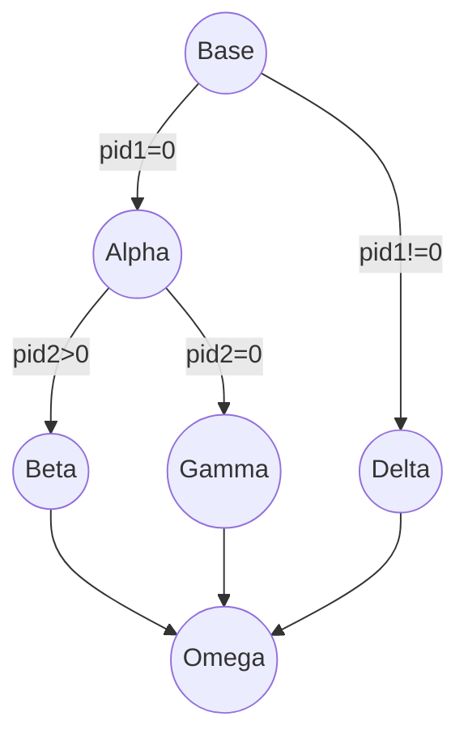

```mermaid
---
displayMode: compact
---
gantt
    title Question 4.1: Round Robin q=3ms
    dateFormat X
    axisFormat %s
    
    section CPU core
    
	P_1: active,  0, 3
	OH: active, 3, 4
	P_2: active, 4, 7
	OH: active, 7, 8
	P_3: active, 8, 11
	OH: active, 11,12
	P_1: active, 12,15
	OH: active, 15,16
	P_2: active, 16, 17
	OH: active, 17, 18
	P_1: active, 18, 20
	
```

# Operating Systems (89-231) — Comprehensive Practice Answers
## User Submission Template

Please fill in your answers in the sections below. Once completed, request the agent to grade/check this file.

---

### Part 1: Von Neumann Architecture, Introduction & Basic OS Structure
**Topic: Shell Command Types & Permissions**

1. **Shell Execution Mechanics:**
   
Cd must be built in becaise if we had it as a seeparate program the shell would have to perform a fork to execute it, the child process would be able to change directory but the parent process would stay in the same directory
   
2. **Access Control List Permissions:**
   - **Symbolic Representation:** 
     rw-r--r--
   - **Owner Actions:** 
     Read write
   - **Group Actions:** 
     Read
   - **Others Actions:** 
     Read

---

### Part 2: Processes
**Topic: Process Lifecycles & POSIX Fork Trees**

1. **Process Tree Diagram:**
   

   
2. **Terminal Output Sequence:**
   
   *Write the printed output lines here:*
   ```text
   Base - Main
   Alpha - pid1
   Gamma - pid2
   Omega - pid2
   Beta - pid1
   Delta - Main
   Omega - Main
   ```
   *Explanation of scheduling factors:*
   

---

### Part 3: Threads
**Topic: Thread Model Resource Sharing & Blocking**

1. **Resource Sharing Behavior:**
   *Complete the table by writing **Unique** or **Shared** for each resource:*

| Resource / Context                   | Shared or Unique? |
| :----------------------------------- | :---------------- |
| Program Counter (PC) & CPU Registers | Unique            |
| User Stack                           | Unique            |
| Heap Memory                          | Shared            |
| Static/Global Variables              | Shared            |
| Open File Descriptors                | Shared            |

2. **Blocking Operations in Many-to-One ($M:1$) Models:**
   
Other User threads have to wait on the IO interrupt to end, while on the 1:1 model they don't need to wait
   

---

### Part 4: Scheduling
**Topic: CPU Scheduling & Context Switches**

1. **Gantt Chart & Waiting Math:**
   - **First-Come, First-Served (FCFS):**
     - *Gantt Chart:*



```mermaid
gantt
    title Question 4.1: FCFS
    dateFormat X
    axisFormat %s
    
    section CPU core
    
	P_1: active,  0, 8
	OH: active, 8, 9
	P_2: active, 9, 13
	OH: active, 13, 14
	P_3: active, 14, 17
```

1. 
     - *Turnaround Times (P1, P2, P3):*
TAT P1 = 8-0 =8
TAT P2 = 13-0  = 13
TAT P3 = 18-0 = 17
     - *ATT:*
$\frac{8+13+17}{3} = 12.67$
     - *Waiting Times (P1, P2, P3):*
WT P1 = 8-8 = 0
WT P2 = 13-4 = 9
WT P3 = 17 -3 = 14
     - *AWT:*

$\frac{0+9+14}{3}=7.67$

   - **Round Robin (RR, $q=3\text{ ms}$):**
     - *Gantt Chart:*




     - *Turnaround Times (P1, P2, P3):*
TAT P1 = 20-0 = 20
TAT P2 = 17-0 = 17
TAT P3 = 11-0=11
     - *ATT:*
$\frac{20+17+11}{3} = 16$
     - *Waiting Times (P1, P2, P3):*
WT P1 = 20 - 8 =12
WT P2 = 17 - 4 = 13
WT P3 = 11 - 3 = 8
     - *AWT:*
$\frac{12+13+8}{3} =11$

2. **System Overhead Trade-offs:**
   
In this specific case there are 2 factors to consider, first the smaller the time quantum is the higher the chance we switch to a process that is about to finish, but taking into account that there is a context switch overhead this affect how many switches we want to make.
We want to keep the time quantum above the Overhead by a reasonable amount so most of the time of the CPU isn't wasted on overhead


   

---

### Part 5: Deadlocks
**Topic: Banker's Matrix & Safety**

1. **Need Matrix Calculation:**
   *Fill in the Need Matrix values for each process:*
   
   $$\textbf{Need} = 
\begin{pmatrix} 
P_0 & 0 & 2 & 0 \\
P_1 & 1 & 2 & 2 \\
P_2 & 6 & 0 & 0 \\
P_3 & 0 & 1 & 1   
\end{pmatrix}$$

2. **Safety State Evaluation:**
   
   
   
3. **Dynamic Request Tracking:**
   
   *Write your answer here. Can the OS grant the request of $[1, 0, 1]$ to $P_1$? Show calculations:*
   

---

### Part 6: Main Memory
**Topic: Two-Level Paging & Effective Access Time**

1. **Address Bit Partitioning:**
   - **Outer Page Table Index bits:** 
   - **Inner Page Table Index bits:** 
   - **Page Offset bits:** 
   *Show address bit division breakdown calculation:*

2. **EAT Calculation:**
   
   *Write your calculations and the final required TLB Hit Ratio ($\alpha$) here:*
   

---

### Part 7: Virtual Memory
**Topic: Page Replacement & Belady's Anomaly**

1. **FIFO Trace & Anomaly Check:**
   - **FIFO with 3 Frames:**
     - *Show trace or faults:*
     - *Total Page Faults:*
   - **FIFO with 4 Frames:**
     - *Show trace or faults:*
     - *Total Page Faults:*
   - **Belady's Anomaly Status:** *Does it occur? Yes/No, and why:*

2. **LRU Frame Mapping:**
   - **LRU with 3 Frames:**
     - *Show trace or faults:*
     - *Total Page Faults:*
   - **Comparison with FIFO 3-frame trace:**
     *Write comparison here:*

---

### Part 8: File System Interface & Implementation
**Topic: Asymmetric Inode Capacity & C-SCAN Disk Head**

1. **Asymmetric Inode Sizing:**
   
   *Write your capacity calculations and final file size limits here:*
   
2. **Disk Scheduling Calculations:**
   
   *Show your C-SCAN track movement sequence and total seek distance calculation here:*
   
