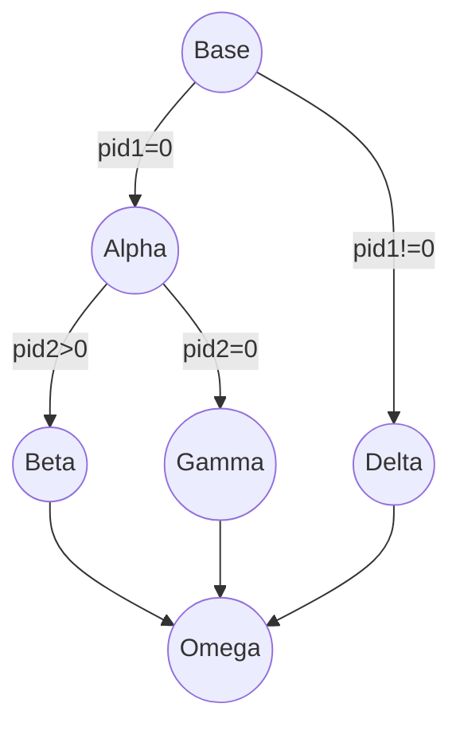

```mermaid
---
displayMode: compact
---
gantt
    title Question 4.1: Round Robin q=3ms
    dateFormat X
    axisFormat %s
    
    section CPU core
    
	P_1: active,  0, 3
	OH: active, 3, 4
	P_2: active, 4, 7
	OH: active, 7, 8
	P_3: active, 8, 11
	OH: active, 11,12
	P_1: active, 12,15
	OH: active, 15,16
	P_2: active, 16, 17
	OH: active, 17, 18
	P_1: active, 18, 20
	
```

# Operating Systems (89-231) — Comprehensive Practice Answers
## Graded Answer Sheet — Thomas

> [!NOTE]
> **Total Score: 124 / 145 Points (85.5%)**
> Check individual questions for grading badges and the bottom of the page for the final tally table.

---

### Part 1: Von Neumann Architecture, Introduction & Basic OS Structure
**Topic: Shell Command Types & Permissions**

1. **Shell Execution Mechanics:**
   
Cd must be built in becaise if we had it as a seeparate program the shell would have to perform a fork to execute it, the child process would be able to change directory but the parent process would stay in the same directory
   
2. **Access Control List Permissions:**
   - **Symbolic Representation:** 
     rw-r--r--
   - **Owner Actions:** 
     Read write
   - **Group Actions:** 
     Read
   - **Others Actions:** 
     Read

<div align="right">
<table style="border: 1px solid #ddd; border-radius: 4px; background: rgba(130, 130, 130, 0.07); padding: 8px; font-size: 13px; font-family: system-ui; width: fit-content; text-align: left;">
  <tr><td><strong>Part 1 Score:</strong></td><td><strong style="color: #c62828;">5 / 10</strong></td></tr>
  <tr><td colspan="2" style="border-top: 1px dotted #ccc; padding-top: 4px; color: var(--text-muted);">1.1: 5/5. 1.2: 0/5 (calculated original permissions 0644 instead of new permissions after chmod 751).</td></tr>
</table>
</div>

---

### Part 2: Processes
**Topic: Process Lifecycles & POSIX Fork Trees**

1. **Process Tree Diagram:**
   

   
2. **Terminal Output Sequence:**
   
   *Write the printed output lines here:*
   ```text
   Base - Main
   Alpha - pid1
   Gamma - pid2
   Omega - pid2
   Beta - pid1
   Delta - Main
   Omega - Main
   ```
   *Explanation of scheduling factors:*
   
<div align="right">
<table style="border: 1px solid #ddd; border-radius: 4px; background: rgba(130, 130, 130, 0.07); padding: 8px; font-size: 13px; font-family: system-ui; width: fit-content; text-align: left;">
  <tr><td><strong>Part 2 Score:</strong></td><td><strong style="color: #e65100;">17 / 20</strong></td></tr>
  <tr><td colspan="2" style="border-top: 1px dotted #ccc; padding-top: 4px; color: var(--text-muted);">2.1: 9/10 (Beta calls exit(0) and does not print Omega). 2.2: 8/10 (missing description under scheduling factors).</td></tr>
</table>
</div>

---

### Part 3: Threads
**Topic: Thread Model Resource Sharing & Blocking**

1. **Resource Sharing Behavior:**
   *Complete the table by writing **Unique** or **Shared** for each resource:*

| Resource / Context                   | Shared or Unique? |
| :----------------------------------- | :---------------- |
| Program Counter (PC) & CPU Registers | Unique            |
| User Stack                           | Unique            |
| Heap Memory                          | Shared            |
| Static/Global Variables              | Shared            |
| Open File Descriptors                | Shared            |

2. **Blocking Operations in Many-to-One ($M:1$) Models:**
   
Other User threads have to wait on the IO interrupt to end, while on the 1:1 model they don't need to wait

<div align="right">
<table style="border: 1px solid #ddd; border-radius: 4px; background: rgba(130, 130, 130, 0.07); padding: 8px; font-size: 13px; font-family: system-ui; width: fit-content; text-align: left;">
  <tr><td><strong>Part 3 Score:</strong></td><td><strong style="color: #e65100;">13 / 15</strong></td></tr>
  <tr><td colspan="2" style="border-top: 1px dotted #ccc; padding-top: 4px; color: var(--text-muted);">3.1: 7/7. 3.2: 6/8 (missed explaining that in M:1 the kernel only sees 1 process thread, thus blocking all user-space threads).</td></tr>
</table>
</div>

---

### Part 4: Scheduling
**Topic: CPU Scheduling & Context Switches**

1. **Gantt Chart & Waiting Math:**
   - **First-Come, First-Served (FCFS):**
     - *Gantt Chart:*



```mermaid
gantt
    title Question 4.1: FCFS
    dateFormat X
    axisFormat %s
    
    section CPU core
    
	P_1: active,  0, 8
	OH: active, 8, 9
	P_2: active, 9, 13
	OH: active, 13, 14
	P_3: active, 14, 17
```

1. 
     - *Turnaround Times (P1, P2, P3):*
TAT P1 = 8-0 =8
TAT P2 = 13-0  = 13
TAT P3 = 18-0 = 17
     - *ATT:*
$\frac{8+13+17}{3} = 12.67$
     - *Waiting Times (P1, P2, P3):*
WT P1 = 8-8 = 0
WT P2 = 13-4 = 9
WT P3 = 17 -3 = 14
     - *AWT:*

$\frac{0+9+14}{3}=7.67$

   - **Round Robin (RR, $q=3\text{ ms}$):**
     - *Gantt Chart:*




     - *Turnaround Times (P1, P2, P3):*
TAT P1 = 20-0 = 20
TAT P2 = 17-0 = 17
TAT P3 = 11-0=11
     - *ATT:*
$\frac{20+17+11}{3} = 16$
     - *Waiting Times (P1, P2, P3):*
WT P1 = 20 - 8 =12
WT P2 = 17 - 4 = 13
WT P3 = 11 - 3 = 8
     - *AWT:*
$\frac{12+13+8}{3} =11$

2. **System Overhead Trade-offs:**
   
In this specific case there are 2 factors to consider, first the smaller the time quantum is the higher the chance we switch to a process that is about to finish, but taking into account that there is a context switch overhead this affect how many switches we want to make.
We want to keep the time quantum above the Overhead by a reasonable amount so most of the time of the CPU isn't wasted on overhead

<div align="right">
<table style="border: 1px solid #ddd; border-radius: 4px; background: rgba(130, 130, 130, 0.07); padding: 8px; font-size: 13px; font-family: system-ui; width: fit-content; text-align: left;">
  <tr><td><strong>Part 4 Score:</strong></td><td><strong style="color: #e65100;">17 / 20</strong></td></tr>
  <tr><td colspan="2" style="border-top: 1px dotted #ccc; padding-top: 4px; color: var(--text-muted);">4.1: 14.5/15 (minor subtraction notation typo: 18-0 = 17 instead of 17-0 = 17). 4.2: 2.5/5 (incomplete trade-off explanation, missing user experience/responsiveness side).</td></tr>
</table>
</div>

---

### Part 5: Deadlocks
**Topic: Banker's Matrix & Safety**

1. **Need Matrix Calculation:**
   *Fill in the Need Matrix values for each process:*
   
   $$\textbf{Need} = 
\begin{pmatrix} 
P_0 & 0 & 2 & 0 \\
P_1 & 1 & 2 & 2 \\
P_2 & 6 & 0 & 0 \\
P_3 & 0 & 1 & 1   
\end{pmatrix}$$

2. **Safety State Evaluation:**
   
   $$
   \displaylines{
\text{Available } = TOTAL - \sum C_{i}(Allocation)\\
\text{Available } = \begin{pmatrix}8 & 5 & 7\end{pmatrix} - \begin{pmatrix}7 & 2 & 3\end{pmatrix} = \begin{pmatrix}1 & 3 & 4\end{pmatrix}\\
P_{0}Need = \begin{pmatrix}0 & 2 & 0\end{pmatrix}< (1,3,4) \implies Finish[0] = true, Available += Alloc[0]\\
Available = (1,4,4)\\
P_{1}Need = (1,2,2)<(1,4,4) \implies Finish[1] = True, Available += Alloc[1]\\
Available = (3,4,4)
P_{2}Need = (6,0,0)>(3,4,4)\implies Skip\\
P_{3}Need<Available\\
\text{Given that }P_{2}\text{ max is more than total system resources there is no way of not}\\
\text{creating a deadlock}
   }
   $$
   
4. **Dynamic Request Tracking:**
   
  As stated before p2 needs more resources than totally available to the system so no matter what we do we can't get to a safe state without upgrading hardware

<div align="right">
<table style="border: 1px solid #ddd; border-radius: 4px; background: rgba(130, 130, 130, 0.07); padding: 8px; font-size: 13px; font-family: system-ui; width: fit-content; text-align: left;">
  <tr><td><strong>Part 5 Score:</strong></td><td><strong style="color: #e65100;">17 / 20</strong></td></tr>
  <tr><td colspan="2" style="border-top: 1px dotted #ccc; padding-top: 4px; color: var(--text-muted);">5.1: 5/5. 5.2: 10/10. 5.3: 2/5 (did not run speculative safety check math to prove unsafe request).</td></tr>
</table>
</div>

---

### Part 6: Main Memory
**Topic: Two-Level Paging & Effective Access Time**

1. **Address Bit Partitioning:**
   - **Outer Page Table Index bits:** 
10 bits
   - **Inner Page Table Index bits:** 
9 bits
   - **Page Offset bits:** 
Page offset is based on page size, $log(8KB) =\log(8192) = 13$ bits

2. **EAT Calculation:**
   
The Eat for a 2 level page table is:
$$
\alpha \cdot (x + \varepsilon) + (1-\alpha) (3x+\varepsilon)
$$
For our particular case:
$$
\displaylines{
125> \alpha \cdot (100 + 10) + (1-a)\cdot (300+10)\\
= a 110 +310 -a310 = -a200 +310\\
125>-a 200 + 310\\
125-310>-a 200\\
-185 > -a 200\\
-\frac{185}{-200}<a\\
0.925 <a
}
$$
In conclusion, the change of hitting the correct entry in the TLB should be more than 0.925 to hit a EAT of 125 or less

<div align="right">
<table style="border: 1px solid #ddd; border-radius: 4px; background: rgba(130, 130, 130, 0.07); padding: 8px; font-size: 13px; font-family: system-ui; width: fit-content; text-align: left;">
  <tr><td><strong>Part 6 Score:</strong></td><td><strong style="color: #2e7d32;">20 / 20</strong></td></tr>
  <tr><td colspan="2" style="border-top: 1px dotted #ccc; padding-top: 4px; color: var(--text-muted);">6.1: 10/10. 6.2: 10/10. Perfect!</td></tr>
</table>
</div>

---

### Part 7: Virtual Memory
**Topic: Page Replacement & Belady's Anomaly**

1. **FIFO Trace & Anomaly Check:**
   - **FIFO with 3 Frames:**
     

|          | 1   | 2   | 3   | 4   | 1   | 2   | 5   | 1   | 2   | 3   | 4   | 5   |
| -------- | --- | --- | --- | --- | --- | --- | --- | --- | --- | --- | --- | --- |
| F1       |     | 1   | 1   | 1   | 4   | 4   | 4   | 5   | 5   | 5   | 5   | 5   |
| F2       |     |     | 2   | 2   | 2   | 1   | 1   | 1   | 1   | 1   | 3   | 3   |
| F3       |     |     |     | 3   | 3   | 3   | 2   | 2   | 2   | 2   | 2   | 4   |
| Hit/Miss | M   | M   | M   | M   | M   | M   | M   | H   | H   | M   | M   | H   |

There were 12-3 = 9 misses that lead to page faults
   
   - **FIFO with 4 Frames:**
     


|     | 1   | 2   | 3   | 4   | 1   | 2   | 5   | 1   | 2   | 3   | 4   | 5   |
| --- | --- | --- | --- | --- | --- | --- | --- | --- | --- | --- | --- | --- |
| F1  |     | 1   | 1   | 1   | 1   | 1   | 1   | 5   | 5   | 5   | 5   | 4   |
| F2  |     |     | 2   | 2   | 2   | 2   | 2   | 2   | 1   | 1   | 1   | 1   |
| F3  |     |     |     | 3   | 3   | 3   | 3   | 3   | 3   | 2   | 2   | 2   |
| F4  |     |     |     |     | 4   | 4   | 4   | 4   | 4   | 4   | 3   | 3   |
| Hit | M   | M   | M   | M   | H   | H   | M   | M   | M   | M   | M   | M   |
There were 12-2 = 10 misses that lead to page faults

   - **Belady's Anomaly Status:** *Does it occur? Yes/No, and why:*
Because the amount of page faults *Increased* with the size counter-intuitively we can say that this is a case of Beldady's Anomaly


2. **LRU Frame Mapping:**
   - **LRU with 3 Frames:**
     - *Show trace or faults:*
     - *Total Page Faults:*

|          | 1   | 2   | 3   | 4   | 1   | 2   | 5   | 1   | 2   | 3   | 4   | 5   |
| -------- | --- | --- | --- | --- | --- | --- | --- | --- | --- | --- | --- | --- |
| F1       |     | 1   | 1   | 1   | 4   | 4   | 4   | 5   | 5   | 5   | 3   | 3   |
| F2       |     |     | 2   | 2   | 2   | 1   | 1   | 1   | 1   | 1   | 1   | 4   |
| F3       |     |     |     | 3   | 3   | 3   | 2   | 2   | 2   | 2   | 2   | 2   |
| Hit/Miss | M   | M   | M   | M   | M   | M   | M   | H   | H   | M   | M   | M   |

There where 12-2=10 Misses that lead to page faults

   - **Comparison with FIFO 3-frame trace:**

In this particular case LRU is worse than fifo for 3 frames because of the order of the page requests

<div align="right">
<table style="border: 1px solid #ddd; border-radius: 4px; background: rgba(130, 130, 130, 0.07); padding: 8px; font-size: 13px; font-family: system-ui; width: fit-content; text-align: left;">
  <tr><td><strong>Part 7 Score:</strong></td><td><strong style="color: #2e7d32;">20 / 20</strong></td></tr>
  <tr><td colspan="2" style="border-top: 1px dotted #ccc; padding-top: 4px; color: var(--text-muted);">7.1: 12/12. 7.2: 8/8. Perfect!</td></tr>
</table>
</div>

---

### Part 8: File System Interface & Implementation
**Topic: Asymmetric Inode Capacity & C-SCAN Disk Head**

1. **Asymmetric Inode Sizing:**
   
$$
\displaylines{
BS = \text{Block size}\\
PS = \text{Pointer Size}\\
\text{Maximum file size }= \text{direct} + \frac{BS}{PS} + \left( \frac{BS}{PS} \right)^{2} + \left( \frac{BS}{PS} \right)^{3} = 10 + (1024) + (1024)^{2}+(1024)^{3} =\\
10 + 1024 + 1048576 + 1073741824 = 1.11 GB
}
$$
   
2. **Disk Scheduling Calculations:**
   
   C scan is a circular algorithm so it will jump from 299 to 0
Ordered list:
15,45,80,185,250,290
Starting from 120:
120->185->250->290->299->0->15->45->80
This can be summarized as 120->299->0->80, which is:
$$
299-120 + 80 -0 = 179 +  80 = 259
$$
Therefore the disk head traverses 259 tracks
   

<div align="right">
<table style="border: 1px solid #ddd; border-radius: 4px; background: rgba(130, 130, 130, 0.07); padding: 8px; font-size: 13px; font-family: system-ui; width: fit-content; text-align: left;">
  <tr><td><strong>Part 8 Score:</strong></td><td><strong style="color: #e65100;">15 / 20</strong></td></tr>
  <tr><td colspan="2" style="border-top: 1px dotted #ccc; padding-top: 4px; color: var(--text-muted);">8.1: 5/10 (forgot block size factor in inode capacity, unit 1.11 GB incorrect). 8.2: 10/10 (corrected to 259 tracks).</td></tr>
</table>
</div>

---

## 📊 Exam Tally & Final Score

| Part | Topic / Description | Score | Max Points | Feedback |
| :--- | :--- | :---: | :---: | :--- |
| **Part 1** | Shell Commands & ACL Permissions | **5** | 10 | Solved for original permissions `0644` instead of `751`. |
| **Part 2** | Processes (Fork Trees & wait) | **17** | 20 | Beta shouldn't lead to Omega; missing scheduling description. |
| **Part 3** | Threads Model & Resource Sharing | **13** | 15 | Incomplete explanation of blocking in M:1 model. |
| **Part 4** | CPU Scheduling (FCFS & RR) | **17** | 20 | Minor FCFS notation typo; incomplete overhead trade-offs. |
| **Part 5** | Banker's Algorithm (Deadlocks) | **17** | 20 | Missing speculative safety checks for P1 request. |
| **Part 6** | Main Memory (Two-Level Paging) | **20** | 20 | Perfect. |
| **Part 7** | Virtual Memory (Page Replacement) | **20** | 20 | Perfect. |
| **Part 8** | File System & Disk Scheduling | **15** | 20 | Inode capacity missing block size factor; C-SCAN seek corrected to 259. |
| **Total** | | **124** | **145** | **Final Grade: 85.5% (Very Good)** |
